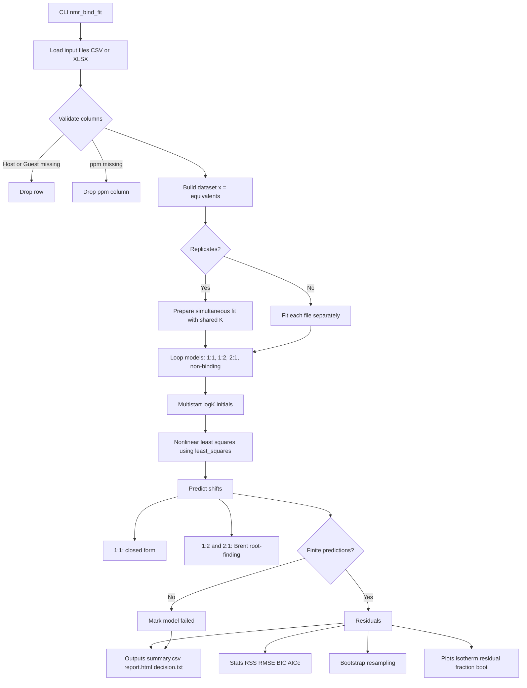

# nmr_bind_fit

[](https://github.com/dhsohn/nmr_bind_fit/actions/workflows/ci.yml)
[](LICENSE)

`nmr_bind_fit` is a Python command-line workflow for NMR chemical-shift titration binding analysis. It fits 1:1, sequential 1:2, sequential 2:1, and non-binding candidate models, then reports information-criterion model comparisons, bootstrap uncertainty, diagnostic warnings, and publication-oriented HTML summaries.

The project is designed as a transparent decision-support tool for host-guest and supramolecular NMR titrations. It does **not** declare the lowest-BIC model to be chemical ground truth; statistical ranking must be interpreted together with fast-exchange behavior, saturation, spectral consistency, and feasible stoichiometry.

For the detailed rationale behind model selection, including BIC/AICc, ΔBIC, bootstrap confidence intervals, and chemical plausibility checks, see [docs/binding_model_selection.md](docs/binding_model_selection.md). For a step-by-step example, see [docs/tutorial.md](docs/tutorial.md).

## Statement of need

NMR chemical-shift titration is widely used to estimate binding constants, but ambiguous titration curves can be overinterpreted when a single binding stoichiometry is assumed in advance or when uncertainty and non-binding controls are not reported. `nmr_bind_fit` provides a reproducible workflow that compares plausible binding stoichiometries and a non-binding linear drift model under the same input/output pipeline. The goal is to make binding-model selection more transparent and to reduce false-positive or overconfident binding-constant reports.

## Installation

Install the latest code from GitHub:

```bash
python -m pip install git+https://github.com/dhsohn/nmr_bind_fit.git
```

For editable development from a local clone:

```bash
git clone https://github.com/dhsohn/nmr_bind_fit.git
cd nmr_bind_fit
python -m pip install -e ".[test]"
```

If you need Excel input support, install the `excel` extra:

```bash
python -m pip install -e ".[excel]"
```

For development with tests and packaging tools:

```bash
python -m pip install -e ".[dev,excel]"
python -m pytest -q
```

## Quick start

Run a single-file fit across all candidate models:

```bash
nmr_bind_fit --input examples/synthetic_11.csv
```

Run bootstrap uncertainty estimation:

```bash
nmr_bind_fit --input examples/synthetic_11.csv --bootstrap 1000
```

If concentrations are not in molar (`M`), set the input unit for report text:

```bash
nmr_bind_fit --input data.csv --concentration-unit mM
```

The numerical fit uses the concentration values exactly as supplied; the input concentration unit defines the reciprocal unit of the reported binding constants.

To include informational residual diagnostics in the report:

```bash
nmr_bind_fit --input data.csv --residual-diagnostics
```

Multiple replicate files with shared binding constants:

```bash
nmr_bind_fit --input data1.xlsx data2.xlsx --replicates
```

BCa-style intervals are available as an experimental option:

```bash
nmr_bind_fit --input data.csv --bootstrap-ci-method bca
```

Note: the current BCa-style implementation uses a bootstrap-sample-based acceleration approximation for computational efficiency. The default percentile bootstrap interval is the conservative choice for publication-facing analyses.

For reproducible, paper-oriented analysis, the CLI uses fixed strict policies: ppm columns with missing values are dropped before fitting, and point-wise nonlinear solver failures in 1:2/2:1 models use fail-fast behavior. `log10 K` is constrained to `[0, 12]` (`K` in `[1e0, 1e12]` in reciprocal concentration units).

## Input format

CSV or XLSX with:

- `[H]t` — total host concentration;
- `[G]t` — total guest concentration;
- one or more ppm columns, for example `ppm`, `ppm_H1`, `ppm_H2`.

The concentration column names are fixed and must be exactly `[H]t` and `[G]t`.

Rows are dropped when host/guest values are missing. If any ppm column contains missing values, that peak column is excluded while remaining peaks are retained. The x-axis is always equivalents (`[G]t/[H]t`).

Example CSV:

```csv
[H]t,[G]t,ppm_H1,ppm_H2
1.0e-3,0.0,7.10,8.22
1.0e-3,2.5e-4,7.15,8.25
1.0e-3,5.0e-4,7.20,8.28
1.0e-3,1.0e-3,7.32,8.34
```

Synthetic examples are available in [examples/](examples/):

- `synthetic_11.csv`
- `synthetic_12.csv`
- `synthetic_21.csv`
- `synthetic_nonbinding.csv`

## Outputs

The output directory is auto-created as `YYYYMMDD_HHMMSS_mmm_<input_name>` (or `..._replicates`) and contains:

- `summary.csv` — model comparison table;
- `decision.txt` — recommended provisional working model and diagnostics;
- `report.html` — plots, methods summary, decision text, and model sections;
- `model_*/` — per-model plots, bootstrap histograms, and correlation matrices when available.

## Flowchart



## Methods summary

NMR chemical-shift titration data are interpreted under a fast-exchange assumption, with observed host-resonance shifts modeled as population-weighted averages of chemical states. Candidate stoichiometries are 1:1 binding (`H + G <=> HG`), sequential 1:2 binding (`H + G <=> HG`; `HG + G <=> HG2`), sequential 2:1 binding (`H + G <=> HG`; `H + HG <=> H2G`), and a non-binding linear drift model. Parameters are estimated by nonlinear least squares (`scipy.optimize.least_squares`). The 1:1 model is solved analytically, while 1:2 and 2:1 are solved numerically point-by-point with Brent's method (`scipy.optimize.brentq`). Uncertainty is evaluated by bootstrap resampling with small `log10 K` perturbations in each refit. Model comparison uses BIC as the primary ranking index with AICc as supporting information. These criteria indicate relative support among tested candidates and should be interpreted together with chemical plausibility and spectral consistency. One shared residual variance term is estimated for model comparison and counted as one additional information-criteria parameter (`k = p + 1`). Replicate titrations are handled by simultaneous fitting with shared binding constants and replicate-specific chemical shifts.

## Citation

If you use `nmr_bind_fit` in research, please cite the repository and the archived release used for your analysis. Citation metadata are provided in [CITATION.cff](CITATION.cff). A release DOI should be added after the first archived release is created.

## Contributing and license

Contributions are welcome through GitHub issues and pull requests. See [CONTRIBUTING.md](CONTRIBUTING.md) for development setup, testing expectations, and data-sharing guidance.

`nmr_bind_fit` is distributed under the MIT License; see [LICENSE](LICENSE).
