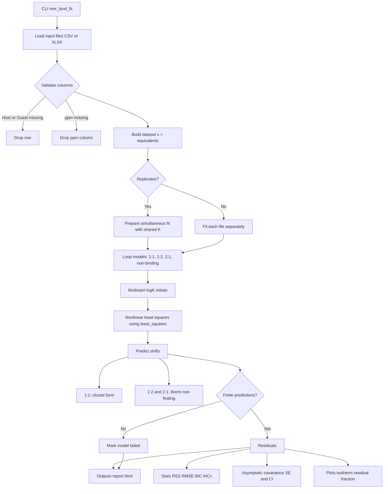

# nmr_bind_fit

[](https://github.com/dhsohn/nmr_bind_fit/actions/workflows/ci.yml)
[](LICENSE)
[](pyproject.toml)
[](https://doi.org/10.5281/zenodo.21071369)

`nmr_bind_fit` is a Python command-line workflow for NMR chemical-shift titration binding analysis. It fits 1:1, sequential 1:2, sequential 2:1, and non-binding candidate models, then reports information-criterion model comparisons, parameter uncertainty, diagnostic warnings, and publication-oriented HTML summaries.

The project is designed as a transparent decision-support tool for host-guest and supramolecular NMR titrations. It does **not** declare the lowest finite-BIC model to be chemical ground truth; statistical ranking must be interpreted together with fast-exchange behavior, saturation, spectral consistency, and feasible stoichiometry.

For the detailed rationale behind model selection, including BIC/AICc, ΔBIC, confidence intervals, and chemical plausibility checks, see [docs/binding_model_selection.md](docs/binding_model_selection.md). For a step-by-step example, see [docs/tutorial.md](docs/tutorial.md).

## Statement of need

NMR chemical-shift titration curves can be overinterpreted when a single binding stoichiometry is assumed in advance or when non-binding alternatives and parameter uncertainty are not examined. `nmr_bind_fit` provides a reproducible workflow that asks two linked questions: which tested stoichiometry is best supported by the isotherm, and whether the data support binding over a non-binding trend. This statistical ranking is reported as a provisional working model to be evaluated together with independent experimental evidence, reducing the risk of false-positive or overconfident binding assignments.

## Installation

Install the latest code from GitHub:

```bash
python -m pip install git+https://github.com/dhsohn/nmr_bind_fit.git
```

The quick-start commands below read the synthetic CSV files from this
repository's `examples/` directory. A direct `pip install` installs the command
line tool, but it does not create an `examples/` directory in your current
working tree; clone/download the repository examples first, or replace the paths
with your own input files.

For editable development from a local clone:

```bash
git clone https://github.com/dhsohn/nmr_bind_fit.git
cd nmr_bind_fit
python -m pip install -e ".[test]"
```

If you need Excel input support, install the `excel` extra:

```bash
python -m pip install -e ".[excel]"
```

For development with tests and packaging tools:

```bash
python -m pip install -e ".[dev,excel]"
python -m pytest -q
```

## Quick start

Run a single-file fit across all candidate models:

```bash
# Run from a clone/source tree that contains examples/synthetic_11.csv.
nmr_bind_fit --input examples/synthetic_11.csv
```

Standard errors and confidence intervals are reported for every successful fit.

Input concentrations must be in molar (`M`). Convert data recorded in other units (for example mM or µM) to molar before running the fit.

To include informational residual diagnostics in the report:

```bash
nmr_bind_fit --input data.csv --residual-diagnostics
```

Multiple replicate files with shared binding constants:

```bash
nmr_bind_fit --input data1.xlsx data2.xlsx --replicates
```

## Input format

CSV or XLSX with:

- `[H]t` — total host concentration in molar (`M`);
- `[G]t` — total guest concentration in molar (`M`);
- one or more ppm columns, for example `ppm`, `ppm_H1`, `ppm_H2`.

The concentration column names are fixed and must be exactly `[H]t` and `[G]t`.

Rows are dropped when host/guest values are missing. If any ppm column contains missing or non-finite values, that peak column is excluded while remaining peaks are retained. The x-axis is always equivalents (`[G]t/[H]t`).

Example CSV:

```csv
[H]t,[G]t,ppm_H1,ppm_H2
1.0e-3,0.0,7.10,8.22
1.0e-3,2.5e-4,7.15,8.25
1.0e-3,5.0e-4,7.20,8.28
1.0e-3,1.0e-3,7.32,8.34
```

Synthetic examples are available in [examples/](examples/):

- `synthetic_11.csv`
- `synthetic_12.csv`
- `synthetic_21.csv`
- `synthetic_nonbinding.csv`

## Outputs

The output directory is atomically created as `YYYYMMDD_HHMMSS_<input_name>` (or `..._replicates`), with an ordinal suffix if that name is already reserved, and contains:

- `report.html` — recommended provisional working model, plots, methods summary, and model sections;
- `model_*/dataset_*/` — dataset-scoped model plots and the parameter correlation matrix.

## Flowchart



## Methods summary

NMR chemical-shift titration data are interpreted under a fast-exchange assumption, with observed host-resonance shifts modeled as population-weighted averages of chemical states. Candidate stoichiometries are 1:1 binding (`H + G ⇌ HG`), sequential 1:2 binding (`H + G ⇌ HG`; `HG + G ⇌ HG2`), sequential 2:1 binding (`H + G ⇌ HG`; `H + HG ⇌ H2G`), and a non-binding linear drift model. Parameters are estimated by nonlinear least squares (`scipy.optimize.least_squares`) with global response scaling that leaves the objective minimum unchanged while making optimizer termination response-unit invariant. The 1:1 model is solved analytically, while 1:2 and 2:1 are solved numerically point-by-point with Brent's method (`scipy.optimize.brentq`). Fits with nonpositive residual degrees of freedom, rank-deficient or severely ill-conditioned dimensionless Jacobians, insufficient dimensionless `log10 K` sensitivity, or binding constants on active bounds are excluded from model comparison. Uncertainty is evaluated from the asymptotic covariance matrix of the converged fit, with Student-t confidence intervals on `log10 K`. Model comparison uses BIC as the primary ranking index with AICc as supporting information. These criteria indicate relative support among tested candidates and should be interpreted together with chemical plausibility and spectral consistency. One shared residual variance term is estimated for model comparison and counted as one additional information-criteria parameter (`k = p + 1`). Replicate titrations are handled by simultaneous fitting with shared binding constants and replicate-specific chemical shifts.

## Citation

If you use `nmr_bind_fit` in research, please cite the archived release used for your analysis rather than the repository alone, so the cited code matches the results. Citation metadata are provided in [CITATION.cff](CITATION.cff). The current release, v0.2.0, is archived at DOI [10.5281/zenodo.21767384](https://doi.org/10.5281/zenodo.21767384). The badge above and DOI [10.5281/zenodo.21071369](https://doi.org/10.5281/zenodo.21071369) resolve to the most recent release across all versions.

## Contributing and license

Contributions are welcome through GitHub issues and pull requests. See [CONTRIBUTING.md](CONTRIBUTING.md) for development setup, testing expectations, and data-sharing guidance.

`nmr_bind_fit` is distributed under the MIT License; see [LICENSE](LICENSE).
